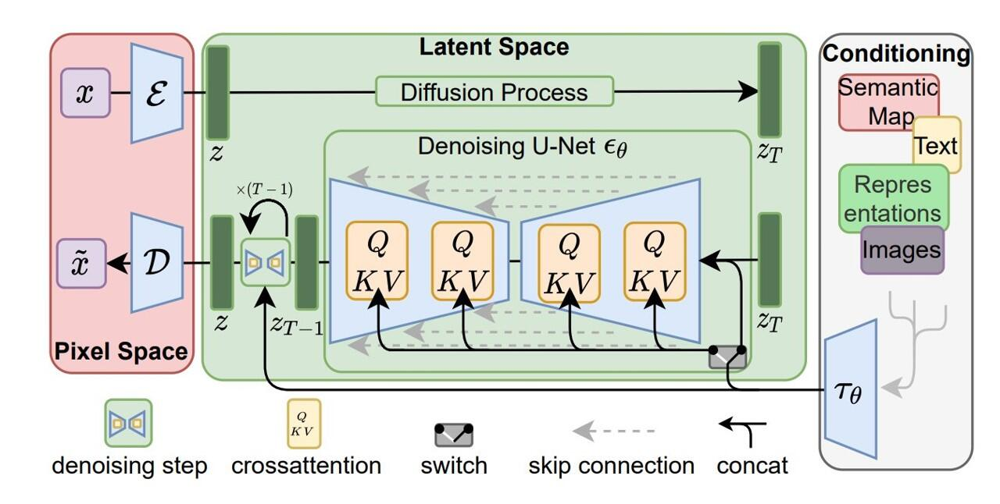

# Image Generation using Stable Diffusion
## Overview
This project aims to replicate Stable Diffusion architecture and few of the improvements that stablize the generation process.
Summary of what implemented in this repository:
* Stable Diffusion Architecure
    * VAE (Variational Auto Encoder)
    * U-Net
    * Text Encoder from CLIP ViT-L/14.
* DDPM (Denoising Diffusion Probabilistic Models)
* DDIM (Denoising Diffusion Implicit Models)
* Beta Cosine based scheduler
* CFG (Classifer free Guidance)
* LoRA (Low Rank Adaptation)
* Dreambooth
* EMA (Exponentially mean averages)
* Gradient Checkpointing
* Gradient Accumulation
* Flash Attention
* Demo App using Gradio

## Workflow


## Setup and Run
1. Create virtual environment from env.yaml
```
conda create --prefix ./.env --file env.yaml
```
2. Activate virtual environment
```
conda activate ./.env
```
3. Generate image
* 3\.1\. Using gradio app
    ```
    python3 app.py
    ```
    **Setting options**:
    * CFG Scale: Set classifer-free guidance scale (larger value tends to focus on conditional prompt, smaller value tends to focus on unconditional prompt)
    * Strength: Set the strength to generate the image (Given image from the user, the smaller value tends to generate an image closer to the original one)
    * Generation Steps: Step to generate image
    * Sampling method: 2 options available: DDPM and DDIM
    * Use cosine-based beta scheduler: Using cosine function to generate beta values used for adding and remove noise from the image.
* 3\.2\. Using command line
    ```
    python3 inference.py
    -h, --help            show this help message and exit
    --model_path          Model path
    --tokenizer_dir       Tokenizer dir
    --device              Choose device to train
    --img_size            Image size
    --img_path            Image path
    --prompt              Input prompt
    --uncond_prompt       Unconditional prompt
    --n_samples           Number of generated images
    --lora_ckpt           Option to use lora checkpoint
    --do_cfg, --no-do_cfg
                          Activate CFG
    --cfg_scale           Set classifer-free guidance scale 
                          (larger value tends to focus on conditional prompt, smaller value tends to focus on unconditional prompt)
    --strength            Set the strength to generate the image (Given image
                          from the user, the smaller value tends to generate an image closer to the original one)
    --num_inference_step  Value: [0-999]
                          Step to generate image
    --sampler             Sampling method (2 options available): DDPM or DDIM
    --use_cosine_schedule, --no-use_cosine_schedule
                          Activate using cosine function to generate beta values used for adding and remove noise from the image.
    --batch_size          Number of images generated in the same
                          time.
    --seed                Seed for reproducibility.
    ```

## References
* Jonathan Ho et al. [“Denoising diffusion probabilistic models.”](https://arxiv.org/abs/2006.11239) arxiv Preprint arxiv:2006.11239 (2020)
* Jiaming Song et al. [“Denoising diffusion implicit models.”](https://arxiv.org/abs/2010.02502) arxiv Preprint arxiv:2010.02502 (2020)
* Alex Nichol & Prafulla Dhariwal. [“Improved denoising diffusion probabilistic models”](https://arxiv.org/abs/2102.09672) arxiv Preprint arxiv:2102.09672 (2021).
* Robin R. and et al, ["High-Resolution Image Synthesis with Latent Diffusion Models"](https://arxiv.org/abs/2112.10752) arxiv Preprint arXiv:2112.10752v2 (2021).
* Jonathan Ho & Tim Salimans. [“Classifier-Free Diffusion Guidance.”](https://arxiv.org/abs/2207.12598) NeurIPS 2021 Workshop on Deep Generative Models and Downstream Applications. (2022)